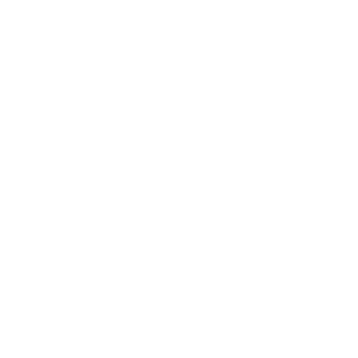

<h1 align="center"> Howdy, I'm Ruo Liu 😃 </h1>

<h3 align="center"> Computer Science Engineer @ UIUC 24'</h3>
<h2>📫 Reach me @</h2>

    
    <a href="mailto:ruoliu2@illinois.edu" target="_blank">
        <picture>
            <source media="(prefers-color-scheme: dark)" srcset="icons/envelope-dark.svg">
            <source media="(prefers-color-scheme: light)" srcset="icons/envelope.svg">
            
        </picture>
    </a>
    
    <a href="https://github.com/ruoliu2" target="_blank">
        <picture>
            <source media="(prefers-color-scheme: dark)" srcset="icons/github-dark.svg">
            <source media="(prefers-color-scheme: light)" srcset="icons/github.svg">
            
        </picture>
    </a>
    
    <a href="https://www.linkedin.com/in/ruo-liu/" target="_blank">
        <picture>
            <source media="(prefers-color-scheme: dark)" srcset="icons/linkedin-dark.svg">
            <source media="(prefers-color-scheme: light)" srcset="icons/linkedin.svg">
            
        </picture>
    </a>
    
    <a href="https://ruoliu.netlify.app" target="_blank">
        <picture>
            <source media="(prefers-color-scheme: dark)" srcset="icons/website-dark.svg">
            <source media="(prefers-color-scheme: light)" srcset="icons/website.svg">
            
        </picture>
    </a>

